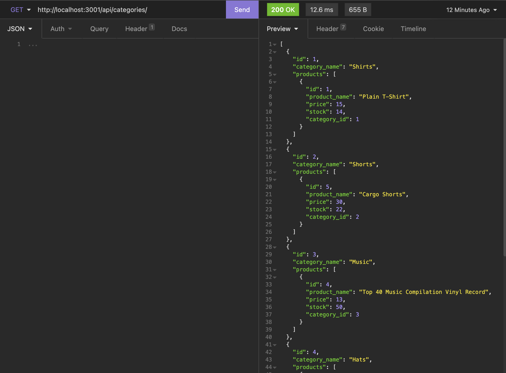
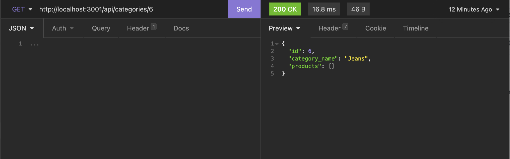
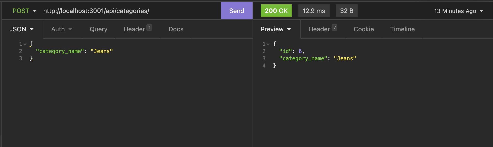
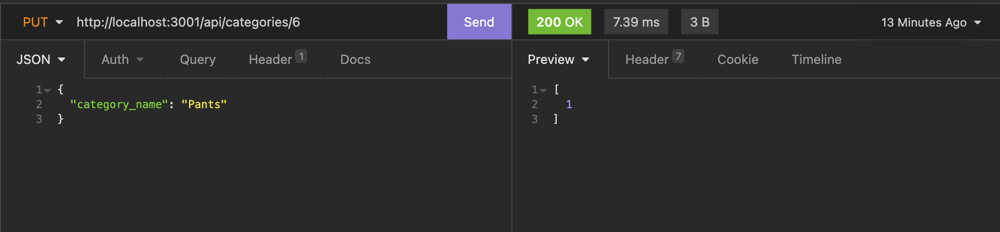
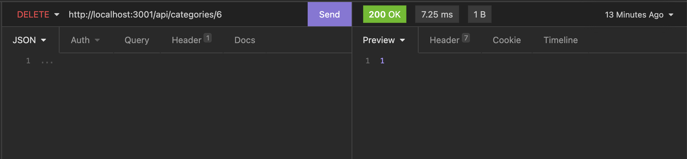

# E-Commerce Back-end
## Object-Relational Mapping Challenge

## Description
This repo contains the back-end code to manage an e-commerce site. This weeks main objective: Object-Relational Mapping, allows us to convert data between incompatible systems using object-oriented programming. ORM libraries, such as Sequelize, allow us to make calls to the database without having to write SQL queries, and can instead use Javascript. This package uses node.js, npm, express.js, sequelize, mysql2, and dotenv packages. There is no front-end for this app, therefore all interactions with the app go through Insomnia. The walk-through video below demonstrates the apps functionality.

## Table of Contents
* [Installation](#installation)
* [Usage](#usage)
* [Video Walkthrough](#video-walkthrough)
* [API Routes Screenshots](#api-routes)
* [Questions](#questions)

## Installation
To install any necessary dependencies run the following command: 

    npm install

## Usage 
Clone the repo to your local machine and open in an IDE. Make sure you have node.js and npm installed (hint: `node -v` & `npm -v`). In the packages root directory, install the following packages: express.js, sequelize, mysql2, and dotenv (`npm i express sequelize mysql2 dotenv`). Also create a `.env` file in the root directory to save sensitive information such as your MYSQL username and password, and database name (ex: `DB_NAME='', DB_USER='', DB_PW=''`). These variables are referenced in the /config/connection.js file. From the mysql shell, run `source db/schema.sql;` to create the schema, quit the mysql shell and run `npm run seed` to seed the tables. Finally run `npm start` to initiate the program, open Insomnia and the app is ready to test/demonstrate API routes: GET, POST, PUT, and DELETE for categories, products, and tags. 

## Video Walkthrough
[Watch video walkthrough](https://drive.google.com/file/d/1CrQtCsvLWRG_vCMsMTJ3gNK3YYwUHb86/view)

## API ROUTES

## Questions
If you have any questions or feedback, create a new issue and add the label "question". 
View more of my work: [github.com/emholmes](https://github.com/emholmes).

